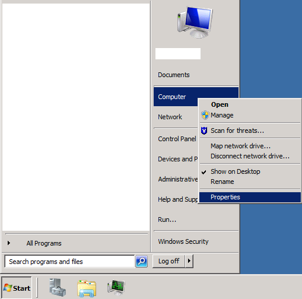
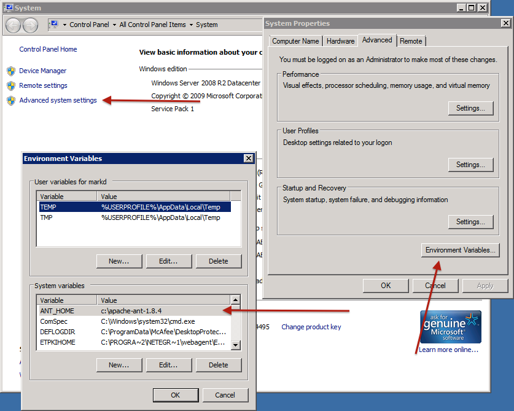

# Introduction #

Mirage 2 is a responsive XMLUI theme for DSpace 4. It is based on the responsive theme for the [Open Knowledge Repository](https://openknowledge.worldbank.org/) by The World Bank. 

Like the original Mirage theme, we started from [HTML5 boilerplate](http://h5bp.com) for the basic structure of each page and best practices with regards to cross browser compatibility, accessibility and performance.

We used [Bootstrap 3](http://getbootstrap.com/) to have a sturdy responsive grid to base everything on. We chose the SASS version ([bootstrap-sass](https://github.com/twbs/bootstrap-sass)) because that allows us to use it in conjunction with the [Compass](http://compass-style.org/) framework, which provides a great library of SASS classes and mixins. Compass also comes with a custom version of the [SASS preprocessor](http://sass-lang.com/) we can use to concatenate and minify all stylesheets. We also included the [Handlebars](http://handlebarsjs.com/) templating framework to create more robust Javascript views.

All these extra dependencies made us reconsider the way front-end dependencies were managed in Mirage 2. A common problem with themes based on the first Mirage was that its dependencies (jQuery, Modernizr, …) were outdated. The versions that came with the theme kept on being used because no-one remembered to update them when creating a new Mirage based theme. So we decided to no longer include 3rd party dependencies with the theme and instead go for a combination of [Bower](http://bower.io/) and [Grunt](http://gruntjs.com/) to fetch and combine dependencies at build time.

These new technologies are put in place to make it easier for the theme developer to produce great themes, but they come with a few new dependencies: node js and ruby. In order to make it easier to get started customizing Mirage2 we added a way to install them automatically durng a maven build.

# Installation #

Mirage 2 has been integrated into the standard maven build as an optional feature. It has to be explicitly enabled by setting the `mirage2.on` to `true`.

```bash
    mvn package -Dmirage2.on=true
```

All extra tools in the Mirage 2 build process run on either Node.js or Ruby, so you'll need both to be able to build the theme. By default, the maven build will assume you don't have either installed and install them in a temporary sandbox every time you build the project. That's convenient, but also quite a bit slower than installing them natively. So we recommend you only use that feature to try out the theme. Afterwards, install the prerequisites and build DSpace with the `mirage2.deps.included` property set to `false`:

```bash
    mvn package -Dmirage2.on=true -Dmirage2.deps.included=false
```

> *WARNING:* Git will need to be installed on the machine running the build in all cases. It will not be installed automatically

## Prerequisites for OSX / Linux ##

### Git ###
If you don't have git installed, go to the [git downloads page](http://git-scm.com/downloads) and follow the instructions for your OS

### Node ###

We recommend using [nvm](https://github.com/creationix/nvm) (Node Version Manager) to install [Node.js](http://nodejs.org/), because it makes it easy to install, use and upgrade node without super user rights.

First download and install nvm:

```bash
    curl -o- https://raw.githubusercontent.com/creationix/nvm/v0.31.7/install.sh | bash 
```

Then, close and reopen your terminal, and install a node version. We’ve been using v6.5.0 during the development of the theme, but it may very well work on other versions

```bash
    nvm install 6.5.0 
```

Set the node version you installed as the default version.

```bash
    nvm alias default 6.5.0
```


### Bower ###

You can install [Bower](http://bower.io/) using the node package manager. The `-g` means install it globally, not as part of a specific project.

```bash
    npm install -g bower
```
Afterwards the command `bower` should show a help message.

### Grunt ###

[Grunt](http://gruntjs.com/) should also be installed globally using the node package manager:

```bash
    npm install -g grunt && npm install -g grunt-cli 
```

Afterwards the command `grunt --version` should show the grunt-cli version number

### Ruby ###

For the same reasons as with Node, we’d advise using ruby via [RVM](http://rvm.io/)  (Ruby Version Manager). Even on OSX, which comes with a version of ruby preinstalled, you can save yourself a lot of hassle by using RVM instead. (In most cases there is no need to uninstall the system ruby first). Note that **you need sudo rights to perform the RVM installation**. You won't need sudo again to use RVM, ruby or gem later on


#### OSX Ruby Note ####
On OSX, you need to have the XCode command line tools installed. To test if they're installed try to type `make` in your terminal, if it says "command not found" follow [these instructions](http://www.computersnyou.com/2025/2013/06/install-command-line-tools-in-osx-10-9-mavericks-how-to/) to install them  
(If this should fail, then you can find and download the Xcode command line tools directly from [Apple Developer site](https://developer.apple.com/downloads/index.action) - You will need an Apple id for this)

Install RVM and ruby:

```bash
    curl -sSL https://get.rvm.io | bash -s stable --ruby
```

### Compass ###

> *WARNING:* **Make sure you are using compatible versions of SASS and Compass.** For example, [Compass v0.12.0 was incompatible with SASS v3.3](https://github.com/Compass/compass/issues/1544). But, Compass v1.0.0 is compatible with SASS v3.3

> *WARNING:* At this time, we do NOT recommend using SASS v3.4.x. The Mirage2 theme is based on [bootstrap-sass](https://github.com/twbs/bootstrap-sass), which currently has a [minor Internet Explorer breadcrumb display bug when using SASS v3.4](https://github.com/twbs/bootstrap-sass/issues/803)

[Compass](http://compass-style.org/) is built on the [SASS CSS preprocessor](http://sass-lang.com/). At the time of writing, we recommend using SASS v3.3.14 with Compass v1.0.1 (see warnings above):

```bash
    gem install sass -v 3.3.14
```

Then you can install compass:

```bash
    gem install compass -v 1.0.1
```

Afterwards the command `compass` should show a help message.

## Prerequisites for Windows ##

### Git ###
If you don't have git installed, you can download the installer [here](http://git-scm.com/download/win).

### Node ###

Download and install [Node.js](http://nodejs.org/) using the Windows installer version.

### Bower ###

You can install [Bower](http://bower.io/) using the node package manager. The `-g` means install it globally, not as part of a specific project.

Execute following command in Windows command prompt:
(Open a Windows command prompt by pressing cmd-R, then type 'cmd' and enter.)

```bash
    npm install -g bower
```
Afterwards the command `bower` should show a help message.

### Grunt ###

[Grunt](http://gruntjs.com/) should also be installed globally using the node package manager:

Perform the following in a Windows command prompt:

```bash
    npm install -g grunt && npm install -g grunt-cli 
```

Afterwards the command `grunt --version` should show the grunt-cli version number

### Ruby ###

Download and install: [Ruby Installer](http://rubyinstaller.org/)

Make sure its environment variables are set in system variables

Open computer properties:



Open "advanced sytem settings". Open "Advanced" tab, and click "environment variables":



Add new variables `GEM_HOME` and `GEM_PATH` pointing to your Ruby gems directory.

### Compass ###

> *WARNING:* **Make sure you are using compatible versions of SASS and Compass.** For example, [Compass v0.12.0 was incompatible with SASS v3.3](https://github.com/Compass/compass/issues/1544). But, Compass v1.0.0 is compatible with SASS v3.3

> *WARNING:* At this time, we do NOT recommend using SASS v3.4.x. The Mirage2 theme is based on [bootstrap-sass](https://github.com/twbs/bootstrap-sass), which currently has a [minor Internet Explorer breadcrumb display bug when using SASS v3.4](https://github.com/twbs/bootstrap-sass/issues/803)

[Compass](http://compass-style.org/) is built on the [SASS CSS preprocessor](http://sass-lang.com/). At the time of writing, we recommend using SASS v3.3.14 with Compass v1.0.1 (see warnings above):

Perform the following in a Windows command prompt:

```bash
    gem install sass -v 3.3.14
```

Then you can install compass:

```bash
    gem install compass -v 1.0.1
```

Afterwards the command `compass` should show a help message.

# Enabling the theme #

Add the following to the `<themes>` section of  `src/dspace/config/xmlui.xconf`, replacing the currently active theme.

```xml
    <theme name="Mirage 2" regex=".*" path="Mirage2/" /> 
```

Now, if you run `mvn package -Dmirage2.on=true` in the dspace project root, bower will download all Mirage 2 dependencies, and Grunt will trigger a number of plugins to preprocess, concatenate and minify all the theme's resources. 


# Customizing the theme #

To create your own, customized version of Mirage 2, you can't do so in `src/dspace/modules/xmlui/src/main/webapp/themes`. Because of its build process, Mirage 2 works a little different. There is a separate module called `xmlui-mirage2` in `src/dspace/modules/`. Any theme you put in that module will be considered a Mirage 2 based theme, and its theme folder only needs to contain the files that differ from the vanilla Mirage 2.

To get you started the module already contains a Mirage 2 folder containing nothing but the `_styles.scss` file. You can copy other files you want to modify to that folder as you go.

# Production and development builds #

You can use Maven profiles to have Grunt build the theme in production or development mode.

In production mode, Grunt will concatenate and minify all javascript files referenced in the `Mirage2/scripts.xml` file (for more details see the javascript section of this document) in to a single `theme.js` file, to improve the performance of the theme. In development mode all javascript files will be separate and untouched, to make debugging easier.

Similarly for CSS, Compass will compile the CSS either using `Mirage2/config-dev.rb` or `Mirage2/config-prod.rb`. Both will yield a single css file: `main.css`, but the dev version won't be minified and will contain the scss file name and line number as a comment above each CSS rule.

By default, Grunt will build the javascript and CSS in production mode. Use the `mirage2_dev` maven profile, or run Grunt with the `dev` task to build the theme in development mode.

### Note: ###

The dspace.cfg property `xmlui.minifiedjs` used in the alpha version of the theme to switch between development and production modes has been deprecated. Because we've moved the javascript declarations to a separate file: `scripts.xml` we no longer need to know which mode you're using in the theme XSLs at runtime but instead can let Grunt handle it at build time.

# DRI Pre-Processing #

One of the goals for this theme was that changes outside the theme’s directory should be kept to an absolute minimum, so other themes won’t be affected by changes made for Mirage 2. But to make a responsive theme we needed to do some major restructuring of DSpace’s UI elements. The traditional way of doing so in XMLUI is adding slightly tweaked copies of default templates to the theme XSL. 

For example, if you want to add an extra class to div, you’d copy the default div template, change the copy's matcher to match the div you want to target, and then add your class to that template. That adds about 10 lines of XSL, only to add a simple CSS class. It makes the theme XSL files much harder to read and to modify; because if you wanted to change the default div template afterwards, you'd also have to change every template that overrides it.

So we added an additional XSL transformation step in the theme’s sitemap: `preprocess.xsl`. This transformation is added right after the DRI generator, and it transforms DRI to DRI. By default it will simply copy the input to the output, and if you want to do something that is perfectly possible in DRI, like adding an extra CSS class to a div, you can now add your exception to the preprocess XSL, and simply let the default div template of the theme XSL render it afterwards. 

### Tip: ###

When working with a DRI that has been changed by the preprocess XSLs, it is often useful to see the differences between the original DRI and the version after preprocessing. To see the original DRI you can add `DRI/` after the contextpath in a page’s URL, to see the preprocessed DRI add `?XML` after the page’s URL

# Style #

Mirage 2 contains two color schemes to choose from. The classic Mirage color scheme or the standard Bootstrap color scheme. By default, Grunt will build CSS to get the classic Mirage color scheme. However, by activating the `mirage2_bootstrap_color_scheme` maven profile, this can be changed to get the standard Bootstrap color scheme. 

The stylesheets are written in [SASS](http://sass-lang.com/). You can find them in the folder `Mirage2/styles`. Each color scheme has its own subfolder, and a `_main.scss` file that imports all others. These files will import the Compass library first. Next, all Bootstrap scss files and finally the DSpace specific files. Both color schemes also import the file `_style.scss`. It contains some example SCSS by default, and is meant to add your own style. Note that CSS is also valid SCSS, so if you don't want to learn SASS, just add plain old CSS to that file and it will work just fine.   

The goal of the standard Bootstrap color scheme was to add as little extra style on top of Bootstrap as possible and instead force ourselves to solve most issues in XSL; by creating the right HTML structure and adding the right bootstrap CSS classes. But try as we might, a few additional style rules were still needed. Those can be found in `shared/_dspace-bootstrap-tweaks.scss`, most of it is limited to styles to improve the sidebar behavior on mobile devices.

The classic Mirage color scheme contains more modifications and also overwrites a few bootstrap variables, in the file `classic_mirage_color_scheme/_bootstrap_variables.scss`. Variables are important because they allow you to change the look of the theme dramatically, simply by changing a few color codes or the font-family. Try to change the value of `$brand-primary` to see what we mean.

Take a look at [bootstrap's own variables file](https://github.com/twbs/bootstrap-sass/blob/master/assets/stylesheets/bootstrap/_variables.scss) to see which others you can overwrite.

If you want to base your theme on an existing Bootstrap theme (like the ones at [bootswatch.com](http://bootswatch.com)) you can do so by using the standard Bootstrap color scheme and replacing the import of Bootstrap in `bootstrap_color_scheme/_main.scss`:

```less
    @import "../vendor/bootstrap-sass-official/vendor/assets/stylesheets/bootstrap";
```

with an import of just its `_variables.sccs` file (those variables need to be defined, because they are used in `_dspace-bootstrap-tweaks.scss`):

```less
    @import "../vendor/bootstrap-sass-official/vendor/assets/stylesheets/bootstrap/_variables";
```

Then import the the css file(s) of your Bootstrap theme of choice below it. Depending on the theme you may also need to update the `twbs-font-path` function right above that import statement.

### Tip: ###
During development it is a hassle to always have to run `mvn package` to re-compile the style and see the result of a CSS change. Luckily Compass comes with a `watch` feature that automatically recompiles when the scss files change. If your editor can update the running webapp when you save an scss file, and you run `compass watch` in that webapp's `xmlui/themes/Mirage2` folder, changes to the style will show up nearly instantaneous.


# Scripts #

Any javascript file that you reference in the file `Mirage2/scripts.xml` will be included in the production `theme.js` file and will be loaded separately and unmodified in development mode. 

The advantage of having all the site’s javascript in a minified single file is that users will only have to make a single request to get all the scripts, so subsequent pages on your repository will load faster. The tradeoff is that all scripts are loaded on every page. That means you’ll have to be extra careful that any script you write only targets the DOM elements you intend to target, and nothing else (meaning, target DOM elements using their IDs and/or very specific class names).

To keep global javascript variables to a minimum, we’ve created a namespace object called `DSpace` to contain all other global variables. For example `DSpace.context_path` and `DSpace.theme_path` contain the context and theme paths, `DSpace.templates` contains compiled handlebars templates, and `DSpace.i18n` contains i18n strings used by those templates (take a look at the object in your browser’s dev-tools on a discovery page to see that in action). We advise you to put your own global javascript objects in the `DSpace` namespace as well.

If you create your own handlebars templates, put them in `Mirage2/templates`. They will be precompiled and added to `theme.js` by Grunt. To access a template in your javascript code, use the function `DSpace.getTemplate(file-name)` (where `file-name` is the name of your handlebars file, without the extension). That function will return a precompiled version of the template if it exists, and download and compile it if it doesn't. That ensures your templates work both when you’re in development mode or using the production `theme.js` file.

The theme also comes with built in support for [CoffeeScript](http://coffeescript.org/). If you put `.coffee` files in the `Mirage2/scripts` folder, they will be converted to javascript. Make sure to add the correct reference to `Mirage2/scripts.xml` i.e. with an `.js` extension instead of `.coffee`.

# Managing dependencies #

Mirage 2's dependencies are specified in the file `Mirage2/bower.json`. Dependencies in this file should be specified according to the rules in the [Bower documentation](http://bower.io/|). Note that Bower only downloads the dependencies, nothing more. So if you add other dependencies, you'll still have to reference them. That means if it’s a CSS file, import it in `Mirage2/styles/_style.scss`, if it's a javascript file, add it to `Mirage2/scripts.xml`.

We've used the the `latest` keyword to specify dependency versions in `bower.json` wherever possible because that ensures you're starting with up to date versions when creating a new theme. However once your theme is going in to production, we strongly recommend replacing `latest` with the actual version numbers being used at that moment. That way your production build won't break when a version of a dependency is released that isn't backwards compatible.

# Multiple themes #

Any folder you create in `src/dspace/modules/xmlui-mirage2/src/main/webapp/themes` will be interpreted as a Mirage2 based theme. This means that if I create two folders called 'Red' and 'Green' in that directory, and create the file `styles/_style.scss` in both folders with the contents 
```css
body {
  background-color: red;
}
```
and
```css
body {
  background-color: green;
}
```
respectively and run `mvn package -Dmirage2.on=true`, two themes will be created called 'Red' and 'Green', with the only difference being the background color of `<body>`
