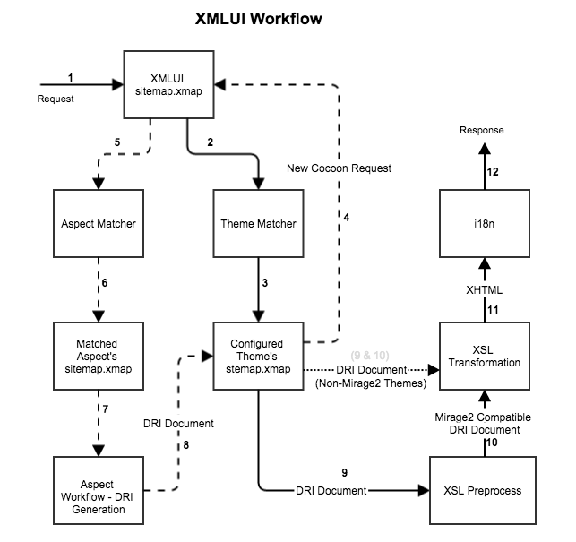

#XMLUI Documentation

###Files related to components:
**NOTE**: *The below list only points to files in main projects. If there are matching files present in the overlay modules, they will have precedence over these files.*
#####XMLUI sitemap
[/dspace-xmlui/src/main/webapp/sitemap.xmap](../../dspace-xmlui/src/main/webapp/sitemap.xmap)

#####Theme Matcher
[/dspace-xmlui/src/main/webapp/themes/themes.xmap](../../dspace-xmlui/src/main/webapp/themes/themes.xmap)

[/dspace/config/xmlui.xconf](../..)

#####Theme's Sitemap
[/dspace-xmlui-mirage2/src/main/webapp/sitemap.xmap](../../dspace-xmlui-mirage2/src/main/webapp/sitemap.xmap)

#####XSL Preprocess
[/dspace-xmlui-mirage2/src/main/webapp/xsl/preprocess.xsl](../../dspace-xmlui-mirage2/src/main/webapp/xsl/preprocess.xsl)

[/dspace-xmlui-mirage2/src/main/webapp/xsl/preprocess/](../../dspace-xmlui-mirage2/src/main/webapp/xsl/preprocess/)

#####XSL Transformation
[/dspace-xmlui-mirage2/src/main/webapp/xsl/theme.xsl](../../dspace-xmlui-mirage2/src/main/webapp/xsl/theme.xsl)

[/dspace-xmlui-mirage2/src/main/webapp/xsl/](../../dspace-xmlui-mirage2/src/main/webapp/xsl/)

[/dspace-xmlui-mirage2/src/main/webapp/styles](../../dspace-xmlui-mirage2/src/main/webapp/styles)

[/dspace-xmlui-mirage2/src/main/webapp/scripts/](../../dspace-xmlui-mirage2/src/main/webapp/scripts)

#####i18n
[/dspace-xmlui/src/main/webapp/i18n/messages.xml](../../dspace-xmlui/src/main/webapp/i18n/messages.xml)

#####Aspect Matcher
[/dspace-xmlui/src/main/webapp/aspects/aspects.xmap](../../dspace-xmlui/src/main/webapp/aspects/aspects.xmap)

#####Aspect's Sitemap
[/dspace-xmlui/src/main/resources/aspects/\*/sitemap.xmap](../../dspace-xmlui/src/main/resources/aspects/)

#####Aspect Workflow & DRI Generation
[/dspace-xmlui/src/main/resources/aspects/\*/\*.js](../../dspace-xmlui/src/main/resources/aspects/)

[/dspace-xmlui/src/main/java/org/dspace/app/xmlui/aspect/*](../../dspace-xmlui/src/main/java/org/dspace/app/xmlui/aspect/)

